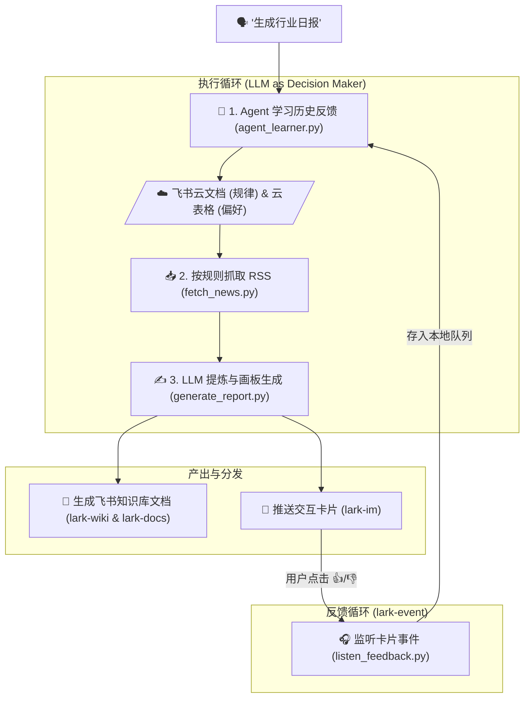

# lark-industry-daily-report-skill

🚀 **飞书行业日报与个性化推荐闭环 (Glass-box AI Agent)**

一句话触发全网行业动态抓取，不仅能自动生成带瀑布流白板的精美“飞书云文档”，还会推送小红书风格的“交互式消息卡片”。
更强大的是，系统基于飞书原生能力实现了 **RLHF (基于人类反馈的强化学习)**：你在卡片上点赞/点踩，Agent 就会自动学习你的偏好，将规律沉淀在飞书云文档中，让推荐**“越用越懂你”**。

## 🌟 它解决什么问题？

每天的信息流里充斥着大量的噪音。传统的 RSS 订阅只是信息的搬运工，而大模型总结往往因为缺乏上下文而显得“千篇一律”。

本 Skill 旨在打造一个 **完全透明（Glass-box）、与用户共生** 的 AI 资讯助理：
1. **自动筛选与提炼**：一键抓取海量 RSS，并由大模型自动分类为“客观事实”、“话题引导”、“工具推荐”三类。
2. **极佳的阅读体验**：摒弃枯燥的纯文本，利用 `lark-whiteboard` 自动渲染出精美的三列排版画板，并同步生成小红书风格的飞书交互式消息卡片。
3. **零门槛的长效记忆（核心亮点）**：利用 `lark-event` 监听卡片点击，Agent 会像人一样分析你的历史偏好，并把学习到的规律“硬编码”到你的**飞书电子表格**和**云文档**中。系统的“大脑”对你完全透明且可编辑！

---

## 🧭 Before / After

| | 传统信息获取 | 本 Skill (lark-industry-daily-report) |
|---|---|---|
| **信息获取** | 逐个打开多个资讯网站 / RSS 阅读器翻阅 | 一句话触发，并发拉取自定义配置的信源 |
| **内容阅读** | 标题党泛滥，需要点开才知道是不是自己想要的 | 飞书画板三列直观展示，提炼核心摘要 |
| **个性化推荐** | 只能靠手动添加屏蔽词，或者忍受平台的“黑盒”推荐算法 | **完全白盒**：你的点击会被 Agent 分析，规律直接写在你自己的飞书云文档里，随时可审阅修改 |
| **工作流** | 读完就忘，无法沉淀 | 每天自动在知识库生成带日期的沉淀文档，形成团队/个人知识库 |

---

## 🚀 快速上手 (Quick Start)

### 1. 安装飞书 CLI 技能
将本项目克隆到本地后，你可以直接使用 Trae 等 AI Agent 平台，告诉 Agent：
> "帮我安装并注册当前目录下的 `organize-industry-daily-report` 技能。"

*(Agent 会自动读取 `SKILL.md` 了解整个工作流与执行逻辑)*

### 2. 一句话执行
安装完成后，只需对 Agent 说：
> **"使用 organize-industry-daily-report 技能，帮我整理今天的人工智能行业日报，并同步到我的知识库中。"**

### 🤖 AI Agent 会自动完成：
1. **环境初始化**：自动检测环境。如果不提供具体参数，Agent 会自动调用飞书 CLI 创建一个全新的“行业日报知识库”空间，并以此作为存储位置。如果你想存入特定空间，只需提供飞书知识库空间 ID (`SPACE_ID`) 和父节点 Token (`PARENT_NODE_TOKEN`)。
2. **记忆读取**：拉取配置表中的白名单、黑名单和 RSS 信源。
3. **抓取与分析**：并发抓取最新资讯，调用 LLM 严格分类提炼。
4. **知识沉淀**：在知识库中自动生成一篇带三列瀑布流画板的《YYYY-MM-DD 行业日报》文档。
5. **卡片推送**：给你的飞书发一张带有【👍多推此类】和【👎减少相似】按钮的交互式卡片。

---

## 🧩 核心功能：越用越懂你的 RLHF 闭环

当你收到飞书卡片后，点击任意按钮，魔法就开始了：

1. **实时反馈**：机器人立刻在卡片下回复“✅ 已收到反馈：加入学习队列”。
2. **LLM as Learner**：系统后台脚本 `agent_learner.py` 定期苏醒，分析你的点击历史（例如：“用户连续点赞了三篇关于人形机器人的文章，点踩了财报类文章”）。
3. **更新飞书大脑**：Agent 会把总结出的规律用自然语言追加到你的 **“Agent选择规律记忆文档（飞书云文档）”** 中。
4. **硬编码偏好**：Agent 自动提取出核心关键词（如“人形机器人”、“财报”），调用 `lark-sheets` 接口，把它们静默写入你的 **“Agent偏好与信源配置表（飞书多维表格）”** 中。

**第二天再生成日报时，它已经变得比昨天更懂你了！**

---

## 🛠️ 安装与配置

### 1. 环境准备
* 确保已安装 [飞书 CLI (lark-cli)](https://github.com/larksuite/cli) 并完成 `lark-cli auth login`。
* 安装 Python 3.8+，并确保终端可执行 `python`。
* 项目依赖安装（若需调用本地 LLM 脚本）：
  ```bash
  pip install requests
  ```

### 2. 飞书开发者后台配置（重要！）
为了让卡片按钮能向本地发送反馈，你需要在飞书开放平台进行简单的事件订阅配置：
1. 登录 [飞书开发者后台](https://open.feishu.cn/app/)，进入你飞书 CLI 绑定的应用。
2. 在 **添加功能** 中，启用 **机器人 (Bot)**。
3. 在 **事件订阅** 菜单中，将订阅方式切换为 **长连接 (WebSocket)**。
4. 在“添加事件”中，搜索并勾选 **`card.action.trigger`**（接收消息卡片交互事件）。
5. 发布新版本。

### 3. 配置知识库节点
在运行技能时，环境参数的配置：
* **自动模式**：如果你不提供任何参数，Agent 默认会为你新建一个名为“行业日报知识库”的飞书知识库空间，并以此作为存储位置。
* **手动模式**：你可以在提问时或在配置阶段向 Agent 提供指定的 `SPACE_ID`（知识库空间 ID）和 `PARENT_NODE_TOKEN`（父节点 Token），让 Agent 将日报存放在指定位置。

*(首次运行时，脚本会自动在你指定的/新建的节点下为你初始化“配置电子表格”和“记忆云文档”)*

### 4. 启动后台监听（接收卡片反馈）
为了捕获卡片点击事件，需要在本地开启一个终端并保持运行：
```bash
python scripts/listen_feedback.py
```

---

## 🏗️ 架构与技术栈



* **框架**：Python + 飞书 CLI (`lark-cli`)
* **画板渲染**：`@larksuite/whiteboard-cli`
* **交互闭环**：`lark-cli event +subscribe` (WebSocket 长连接)
* **状态存储**：完全依赖飞书云端生态 (`lark-sheets` / `lark-docs`)，本地零数据库。

---

## 🤝 贡献与参与 (Contributing)

我们非常欢迎来自社区的贡献！无论是发现 Bug、提供新想法，还是提交 PR 来改进这个 Skill，我们都非常期待。

如果你想参与贡献，请参考以下步骤：
1. Fork 本仓库
2. 创建你的特性分支 (`git checkout -b feature/AmazingFeature`)
3. 提交你的更改 (`git commit -m 'Add some AmazingFeature'`)
4. 推送至分支 (`git push origin feature/AmazingFeature`)
5. 发起一个 Pull Request

---

## 📜 许可证 (License)

本项目采用 [MIT License](LICENSE) 开源协议。你可以自由地使用、修改和分发本项目，只需保留原作者的版权声明。

---

## ⚠️ 免责声明 (Disclaimer)

1. **API 与权限限制**：本项目深度依赖于飞书 OpenAPI 与飞书 CLI 工具，使用者需自行确保在飞书开发者后台拥有合法的调用权限与额度。
2. **大模型生成内容**：本项目使用第三方大语言模型（LLM）进行内容的翻译、提炼和分类。LLM 生成的内容可能存在幻觉或不准确的情况，使用者需自行甄别与审核最终生成的文档与卡片内容，作者不对生成内容的准确性与合规性负责。
3. **安全风险提示**：请妥善保管你的飞书应用凭证（App ID、App Secret 等）及个人配置 Token，切勿将其硬编码并提交至公开的开源仓库中。

---

## 🙏 致谢 (Acknowledgments)

本项目的设计思想与架构灵感深受开源项目 [AutoContents](https://github.com/comeonzhj/AutoContents) 的启发。

特别感谢原作者佳哥 ([@comeonzhj](https://github.com/comeonzhj)) 提供的绝佳思路。